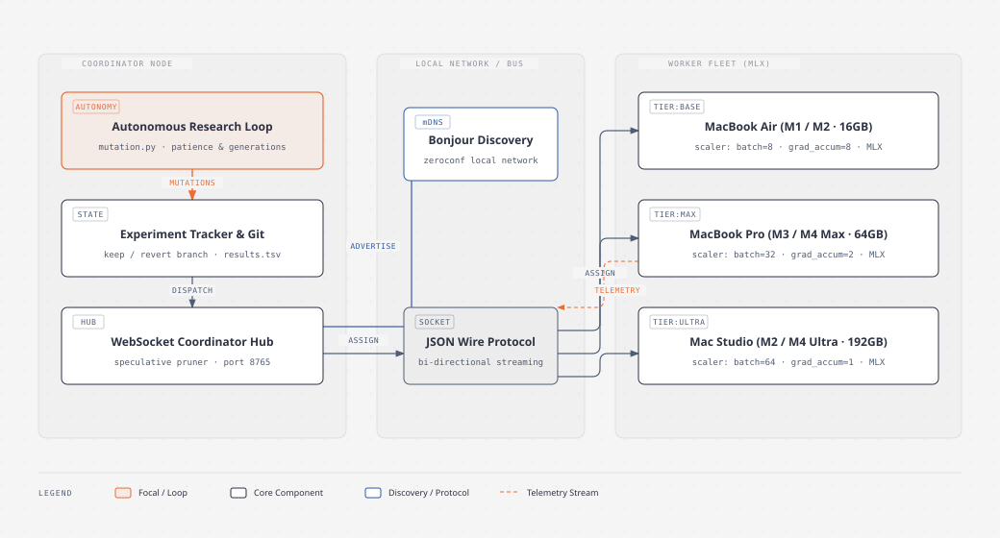
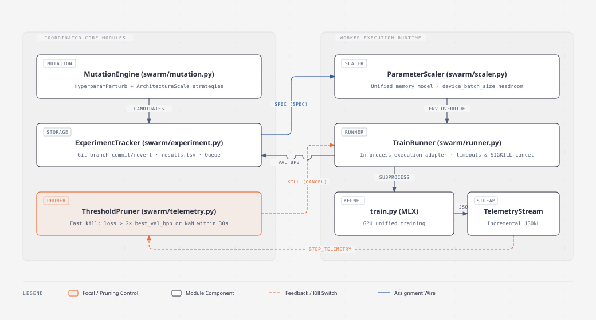

# BitResearch MLX

A distributed Apple Silicon (MLX) port of [Karpathy's autoresearch](https://github.com/karpathy/autoresearch), extended for **autonomous swarm execution across multiple Macs**. Inspired by [Darkbloom's](https://darkbloom.dev) architecture for distributed inference on Apple Silicon, this project turns a cluster of idle Macs on your local network into a self-driving, hardware-adaptive AI research lab.

Full credit to [@karpathy](https://github.com/karpathy) for the core paradigm: fixed-budget autonomous research loops via `program.md`. BitResearch MLX preserves the foundational rules — single mutable `train.py`, target metric `val_bpb`, fixed 5-minute training budget, and git keep/revert — while horizontally scaling exploration across heterogeneous Apple Silicon hardware using mDNS discovery, adaptive parameter scaling, real-time telemetry, and speculative pruning.

---

## System Architecture

BitResearch MLX is architected across two tiers: a high-level distributed swarm topology and a deep low-level execution pipeline.

### High-Level Design (HLD)

The swarm operates in a star topology coordinated over the local network via Bonjour and WebSockets.



> **Interactive version**: Open [docs/diagrams/hld.html](docs/diagrams/hld.html) in your browser.

#### Topology & Responsibilities
- **Coordinator Node (`swarm/coordinator.py`)**:
  - **Autonomous Engine**: Generates experiment mutations in generations, tracks patience, and decides when to branch or halt.
  - **Experiment Tracker & Git Manager**: Maintains experiment history, branches, and commit decisions in `results.tsv`. Winning runs (`val_bpb < best`) are committed to git; regressions are discarded.
  - **Coordinator Hub**: Runs an async WebSocket server (default port `8765`) handling experiment assignments, result collation, and speculative kill signals.
- **Local Network Bus**:
  - **Bonjour Discovery (`swarm/discovery.py`)**: Zero-configuration mDNS service (`_bitresearch._tcp.local`). Workers automatically detect the coordinator without manual IP configuration.
  - **JSON Wire Protocol (`swarm/protocol.py`)**: Typed bi-directional messaging over WebSockets for heartbeats, experiment specifications, live step telemetry, and cancellations.
- **Worker Fleet (`swarm/worker.py`)**:
  - Heterogeneous Apple Silicon Macs (M1/M2/M3/M4 across Base, Pro, Max, Ultra) running native MLX on unified memory.
  - Workers dynamically receive model configurations, auto-tune execution parameters, train in isolation, and stream telemetry back to the coordinator.

---

### Low-Level Design (LLD)

The internal architecture replaces shallow subprocess scraping with a deep, in-process execution and feedback pipeline.



> **Interactive version**: Open [docs/diagrams/lld.html](docs/diagrams/lld.html) in your browser.

#### Core Subsystems

#### 1. Autonomous Research Loop (`swarm/mutation.py`)
- **`MutationEngine`**: Coordinates multi-strategy hypothesis generation. Given baseline `train.py` and experiment history, generates deduplicated batches of mutation candidates.
- **`HyperparamPerturbStrategy`**: Perturbs numeric learning rates (`EMBEDDING_LR`, `MATRIX_LR`, `UNEMBEDDING_LR`, `SCALAR_LR`), weight decay, and warmup/warmdown schedules within safe operational bounds.
- **`ArchitectureScaleStrategy`**: Explores architectural dimensions (`DEPTH`, `ASPECT_RATIO`) while preserving head dimensions.
- **Lineage Tracking**: Each candidate tracks `generation`, `parent_experiment_id`, and exact applied mutations.

#### 2. Adaptive Parameter Scaler (`swarm/scaler.py`)
- **Unified Memory Model**: Estimates memory requirements before running:
  $$\text{Base Memory} = \text{Model Weights (bfloat16)} + \text{Optimizer State (AdamW } m, v, \text{fp32 copy)}$$
  $$\text{Activation Memory} \propto \text{Batch} \times \text{Sequence Length} \times n_\text{embd} \times \text{Depth} \times 4$$
- **Hardware-Aware Batching**: Uses binary search to compute the maximum safe `device_batch_size` within 85% of physical unified memory, scaling `grad_accum_steps` to hit the target total batch size ($2^{16}$ tokens).
- **Environment Overrides**: Injects `BITRESEARCH_DEPTH`, `BITRESEARCH_DEVICE_BATCH_SIZE`, and `BITRESEARCH_TOTAL_BATCH_SIZE` into `train.py` without requiring AST rewrites.

#### 3. In-Process Execution Adapter (`swarm/runner.py`)
- **`TrainRunner`**: Replaces raw subprocess and symlink hacks with a typed `RunConfig` $\rightarrow$ `RunResult` adapter.
- **Zero-Symlink PYTHONPATH Resolution**: Injects the repository root into `PYTHONPATH` so `prepare.py` is resolved cleanly by any experiment directory.
- **Pure Metric Extraction**: `parse_final_metrics()` extracts the summary block (`val_bpb`, peak VRAM, step time, tokens/sec) via regex.
- **Process Lifecycle**: Handles background thread execution, timeout bounds, and clean `SIGKILL` termination upon coordinator cancellation.

#### 4. Step-Level Telemetry & Speculative Pruning (`swarm/telemetry.py`)
- **Zero-Overhead JSONL Logging**: `train.py` appends debiased loss, learning rate multiplier, throughput, and VRAM to `telemetry.jsonl` when `BITRESEARCH_TELEMETRY_FILE` is set.
- **`TelemetryStream`**: An incremental file-tailing reader that feeds `StepMetrics` to the worker daemon.
- **`ThresholdPruner`**: Evaluates active experiments on the coordinator. If loss after step 30 exceeds $2 \times \text{best\_val\_bpb}$ or encounters `NaN`/`Inf`, an `EXPERIMENT_CANCEL` message is immediately dispatched.
- **Compute Savings**: Terminates divergent architectures in ~30 seconds instead of wasting the entire 5-minute training budget.

---

## Quick Start

### Requirements
- Apple Silicon Mac(s) (M1, M2, M3, M4)
- macOS 13.0+
- Python 3.10+
- [uv](https://docs.astral.sh/uv/) package manager

### 1. Installation

```bash
# Clone the repository
git clone https://github.com/gauravsaini/bitresearch-mlx.git
cd bitresearch-mlx

# Install dependencies using uv
uv sync
```

### 2. Prepare Data (on each machine)

```bash
uv run bitresearch prepare
# or directly:
uv run prepare.py
```

### 3. Start Coordinator

#### Autonomous Self-Driving Mode
Run an autonomous research loop that generates, evaluates, and keeps winning models across the swarm:
```bash
uv run bitresearch coordinator --autonomous --max-generations 10 --patience 3
```

#### Manual / Passive Mode
Run the coordinator as an experiment queue driven by external agents or CLI submissions:
```bash
uv run bitresearch coordinator --port 8765
```

The coordinator automatically broadcasts its presence over Bonjour/mDNS.

### 4. Start Worker Nodes (on each additional Mac)

```bash
# Auto-discover coordinator via Bonjour:
uv run bitresearch worker

# Or specify coordinator URL explicitly:
uv run bitresearch worker --coordinator-url ws://192.168.1.100:8765
```

### 5. Manual Experiment Submission

To manually dispatch a specific `train.py` variant:
```bash
uv run bitresearch submit \
  --coordinator-url ws://localhost:8765 \
  --description "increase depth to 6 with 0.4 embedding lr" \
  --train-py train.py
```

### 6. Cluster Status & Diagnostics

```bash
uv run bitresearch status
uv run bitresearch hardware
```

---

## Hardware Tiers & Memory Scaling

The swarm categorizes Apple Silicon into four tiers and scales batch execution dynamically:

| Tier | Unified Memory | Memory Budget | Typical Hardware | Scaling Profile |
|------|----------------|---------------|------------------|-----------------|
| `base` | < 32 GB | $\le$ 13.6 GB usable | MacBook Air, Mac Mini (M1/M2/M4 16GB) | `device_batch=8`, `grad_accum=8` |
| `pro` | 32–63 GB | $\le$ 27.2 GB usable | MacBook Pro (M1/M2/M3 Pro 32GB) | `device_batch=16`, `grad_accum=4` |
| `max` | 64–127 GB | $\le$ 54.4 GB usable | MacBook Pro, Mac Studio (M2/M3/M4 Max 64-96GB) | `device_batch=32`, `grad_accum=2` |
| `ultra` | $\ge$ 128 GB | $\le$ 163.2 GB usable | Mac Studio, Mac Pro (M2/M4 Ultra 128-192GB) | `device_batch=64`, `grad_accum=1` |

---

## Repository Structure

```
bitresearch-mlx/
├── prepare.py              # Data download, tokenizer, and evaluation (fixed)
├── train.py                # Single-file MLX GPT pretraining loop
├── program.md              # Autonomous research guidelines
├── results.tsv             # Experiment ledger and tracking history
├── swarm/
│   ├── cli.py              # Click command-line interface
│   ├── coordinator.py      # Swarm coordinator and autonomous loop daemon
│   ├── discovery.py        # Zeroconf / Bonjour mDNS auto-discovery
│   ├── experiment.py       # Experiment dataclass, history, and git branch tracker
│   ├── hardware.py         # Apple Silicon hardware capability detection
│   ├── mutation.py         # Autonomous mutation engine & perturbation strategies
│   ├── protocol.py         # WebSocket message schema & telemetry payloads
│   ├── runner.py           # In-process TrainRunner execution adapter
│   ├── scaler.py           # Hardware unified memory parameter scaler
│   ├── telemetry.py        # Incremental JSONL stream & ThresholdPruner
│   └── worker.py           # Distributed worker node daemon
├── docs/
│   └── diagrams/
│       ├── hld.html        # Interactive High-Level Design diagram
│       ├── hld.svg         # Standalone HLD architecture SVG
│       ├── lld.html        # Interactive Low-Level Design diagram
│       └── lld.svg         # Standalone LLD architecture SVG
└── tests/
    ├── test_mutation.py    # Mutation engine & autonomous loop tests
    ├── test_runner.py      # Subprocess execution & metric parsing tests
    ├── test_scaler.py      # Hardware memory modeling & batch scaling tests
    ├── test_swarm.py       # End-to-end swarm integration & protocol tests
    └── test_telemetry.py   # Step telemetry & speculative pruning tests
```

---

## Testing & Verification

Run the comprehensive test suite with `uv`:

```bash
uv run pytest
```

All 45 tests validate:
- In-process runner timeouts, cancellations, and telemetry capture
- Adaptive scaler unified memory formulas and warning thresholds
- Real-time telemetry streaming and speculative threshold pruning
- Mutation engine reproducibility, bounds compliance, and deduplication
- End-to-end WebSocket networking, registration, and git state commits

---

## Acknowledgments

- [Andrej Karpathy](https://github.com/karpathy) — [autoresearch](https://github.com/karpathy/autoresearch) and [nanochat](https://github.com/karpathy/nanochat)
- [trevin-creator/autoresearch-mlx](https://github.com/trevin-creator/autoresearch-mlx) — Apple Silicon MLX port
- [Darkbloom / Eigen Labs](https://darkbloom.dev) — Distributed provider architecture on Apple Silicon
- [scasella/nanochat-mlx](https://github.com/scasella/nanochat-mlx) — MLX GPT and optimizer reference
- [Apple MLX Team](https://github.com/ml-explore/mlx) — Machine learning framework for Apple Silicon

---

## License

MIT
